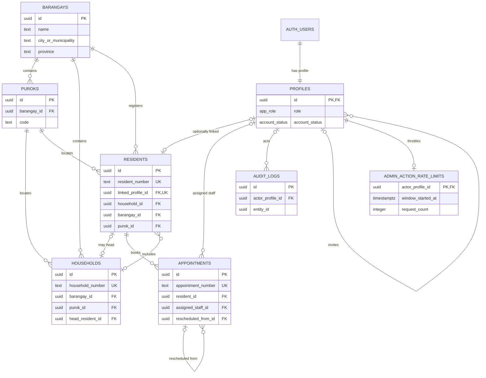

# Relationships through Phase 3B

## Entity relationship diagram

`AUTH_USERS` represents Supabase's `auth.users` table and is not created by these
migrations. `audit_logs.entity_id` is intentionally polymorphic and therefore
cannot have one foreign key; `entity_type` identifies the source table.

## Foreign keys

| Child column(s)                                   | Parent column(s)                         | Delete behavior | Purpose                                                               |
| ------------------------------------------------- | ---------------------------------------- | --------------- | --------------------------------------------------------------------- |
| `profiles.id`                                     | `auth.users.id`                          | Cascade         | One profile per Auth user                                             |
| `puroks.barangay_id`                              | `barangays.id`                           | Restrict        | Purok ownership                                                       |
| `households.barangay_id`                          | `barangays.id`                           | Restrict        | Household locality                                                    |
| `households.(purok_id, barangay_id)`              | `puroks.(id, barangay_id)`               | Restrict        | Prevent cross-barangay puroks                                         |
| `residents.linked_profile_id`                     | `profiles.id`                            | Set null        | Optional resident login                                               |
| `residents.(household_id, barangay_id, purok_id)` | `households.(id, barangay_id, purok_id)` | Restrict        | Household/location consistency                                        |
| `residents.(purok_id, barangay_id)`               | `puroks.(id, barangay_id)`               | Restrict        | Resident locality consistency                                         |
| `residents.created_by`, `updated_by`              | `profiles.id`                            | Set null        | Attribution without blocking profile removal                          |
| `households.(head_resident_id, id)`               | `residents.(id, household_id)`           | Restrict        | Head must belong to household                                         |
| `appointments.resident_id`                        | `residents.id`                           | Restrict        | Scheduling ownership                                                  |
| `appointments.assigned_staff_id`                  | `profiles.id`                            | Set null        | Optional staff assignment                                             |
| `appointments.rescheduled_from_id`                | `appointments.id`                        | Restrict        | Rescheduling lineage                                                  |
| `appointments.created_by`, `updated_by`           | `profiles.id`                            | Set null        | Scheduling attribution                                                |
| `audit_logs.actor_profile_id`                     | `profiles.id`                            | Restrict        | Preserve actor identity and block deletion that would rewrite history |
| `profiles.invited_by`                             | `profiles.id`                            | Restrict        | Preserve trusted invitation attribution                               |
| `admin_action_rate_limits.actor_profile_id`       | `profiles.id`                            | Cascade         | Internal per-administrator abuse-control window                       |

## Circular-dependency handling

Households must exist before residents can reference them, while a household head
must be a resident. Migration 3 creates nullable `head_resident_id` without a
foreign key. Migration 4 creates residents. Migration 5 then adds the composite
head relationship. There is no temporary disabled constraint and no free-text
resident relationship.

Phase 3A validates the relationship before writes: the household must be current
and share the resident's barangay/purok, the head must be a current member, and a
head cannot be moved or archived until the role is reassigned.

## Cardinality and optionality

- A barangay has many puroks, households, and residents.
- A purok belongs to exactly one barangay.
- A household belongs to exactly one barangay and purok.
- A resident may temporarily have no household but always has a barangay/purok.
- A household may have no head while initial members are being registered.
- A profile may link to at most one resident, and a resident to at most one profile.
- An appointment belongs to one resident and may have one assigned staff profile.
- An appointment may reference one earlier appointment; conflict and chain-cycle
  validation is deferred to the scheduling workflow.

Phase 3B permits resident/profile link changes only through service-role-only
administrator RPCs. A linked profile must have role `resident`, status `active`
or `invited`, and no existing resident link. Direct browser mutation is rejected;
unlinking preserves the Auth user and profile.
